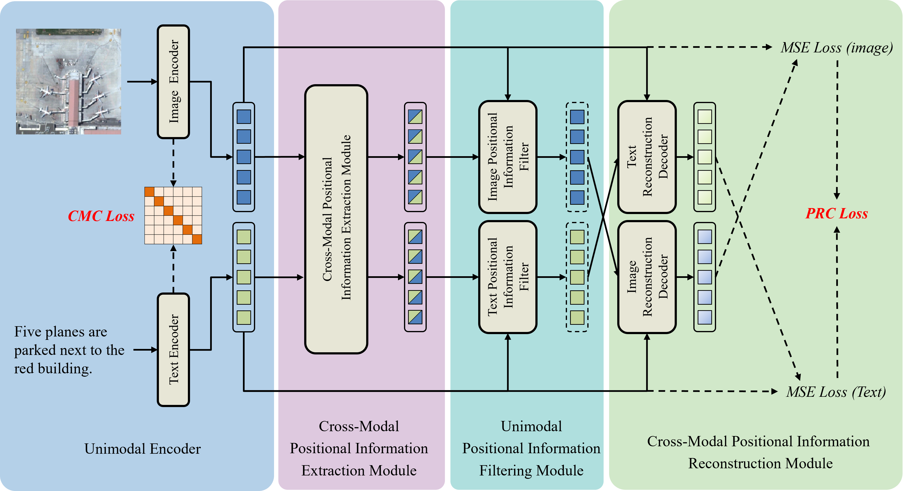

# PR-CLIP: A New Multimodal Remote Sensing Retrieval Model Based on Cross-Modal Positional Information Reconstruction

This is the repository of PR-CLIP: A New Multimodal Remote Sensing Retrieval Model Based on Cross-Modal Positional Information Reconstruction.

PR-CLIP is trained with the [`ITRA`](https://itra.readthedocs.io/) codebase



### Requirements:

```
torch==2.5.1
torchvision==0.20.1
scikit-learn==1.5.1
transformers==4.45.2
adapter-transformers==4.0.0
open_clip_torch==2.20.0
clip-benchmark==1.6.1
numpy==1.24.3
pandas==2.2.3
pillow==11.0.0
```

### Download:

- Download images from https://drive.google.com/file/d/15htMe2iE4kVujjWURxfCxZXk8vAAetoT/view?usp=drive_link and put them into ```./images/```

- Download checkpoints from https://drive.google.com/file/d/15htMe2iE4kVujjWURxfCxZXk8vAAetoT/view?usp=drive_link and put them into ```./cache/weights/```

### RSITR:

train and test on RSICD

```
sh train_rsicd.sh [gpu number] [port] [log_name]
```

train and test on RSITMD

```
sh train_rsitmd.sh [gpu number] [port] [log_name] 
```

test only

```
python retrieval.py
```
